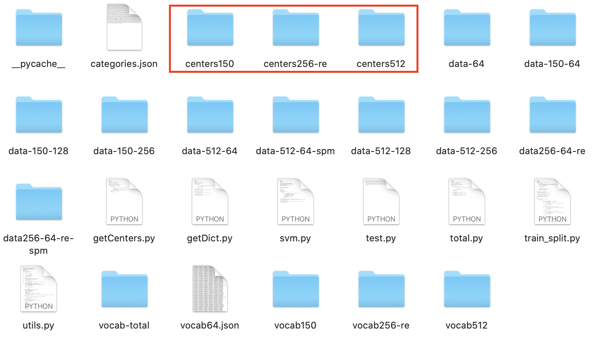
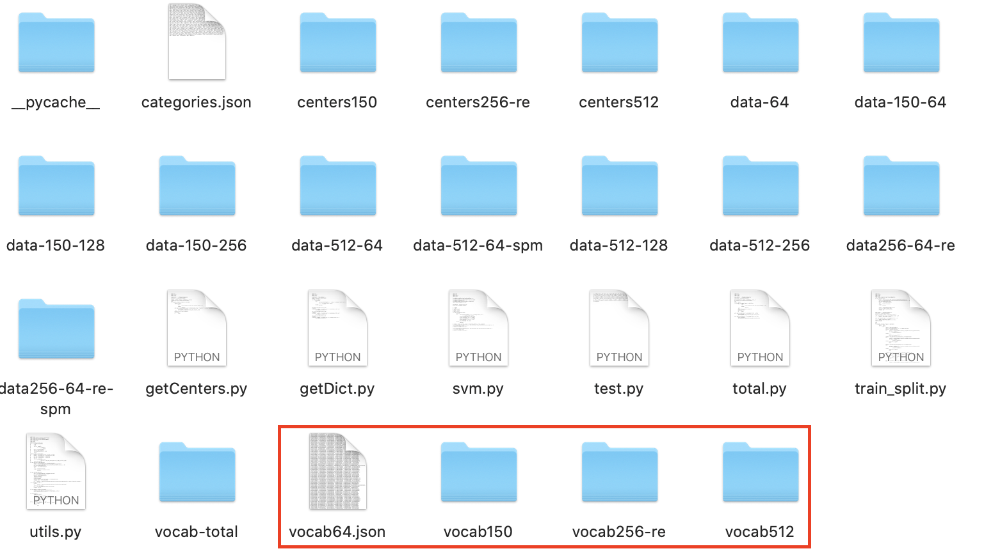
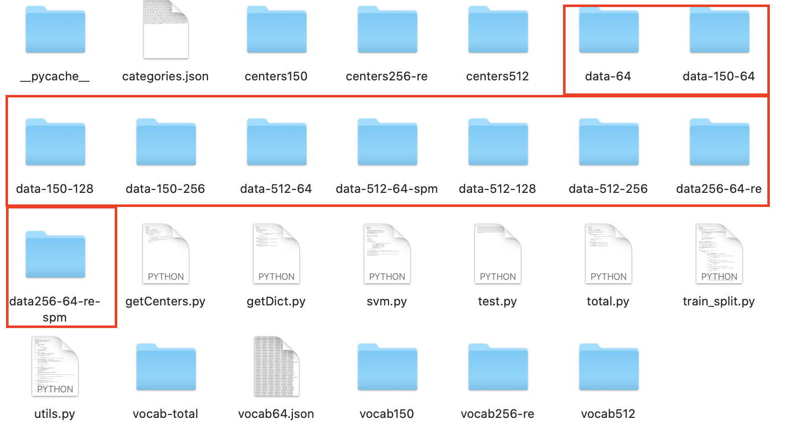

# CV Homework2 Image Classification

## How to use 

#### To use the two level KMeans method:

- run `getCenters.py` to get the first level KMeans, remember to chage the path and create a corresponding file to save the data. e.g.

- run `getDict.py` to get the second level KMeans i.e., the dictionary, remember to change the path and create corresponding file to save this. e.g.

  

#### To run with restirction on SIFT:

- run `total.py` and change the `get_repr_resize()` function to the desired restriction, remember to change the path and create corresponding file to save this. 

#### After obtaining the dictionary:

- run `train_split.py` and change the correspongding parameters to get training and testing data with label, remember to change the path and create corresponding file to save this. e.g.

- run `svm.py` to get the result, remember to change the path and corresponding parameters for svm and training size. 

